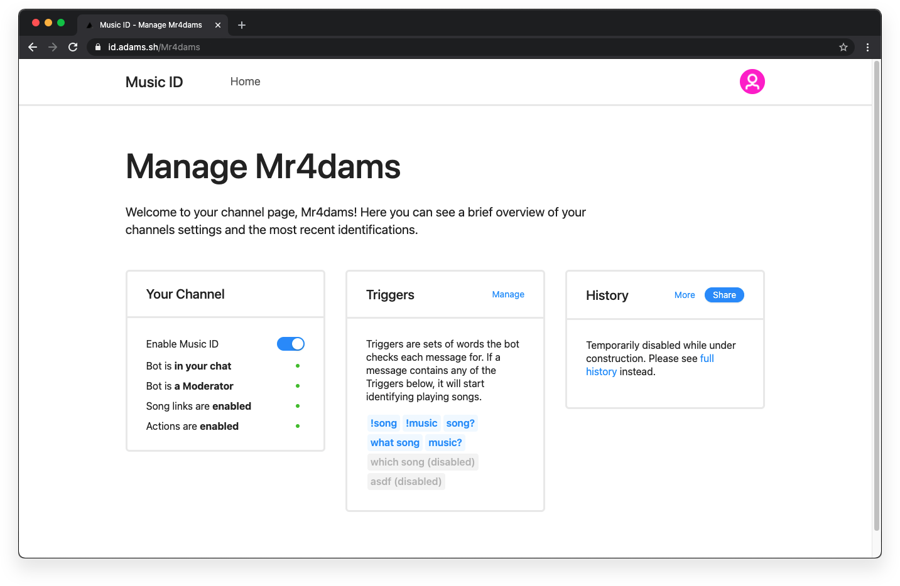

    <a href="https://adams.sh/twitch">
        
        <h1 align="center">Music ID for Twitch</h1>
    </a>

    
    
    

    <a href="https://github.com/4dams/twitch-music-id/issues" target="_blank">
        
    <a>
    

    <b>Do you want to learn more about this project and ACRCloud?</b> Check out <a href="https://medium.com/@juriadams/273b2ae7a8cb" target="_blank">this post</a>!

## Description

**Music ID for Twitch** is a Chat Bot that automatically identifies music running in the background of [Twitch](https://twitch.tv/) Streams, VODs, and Clips.

The Bot originally started as a school project in [PSZileans Channel](https://twitch.tv/ratirl) and was intended to run for about two weeks to collect various data points to analyze later on. However, the project gained so much positive feedback that I decided to keep it running. Today, [TwitchMusicID](https://twitch.tv/twitchmusicid) is part of **more than 500 Twitch Channels** and received almost **one million identification requests** which about **85% were successful**.

## Live Example

## Add the Bot

If you want to use **Music ID for Twitch** in your Twitch Channel, please visit [adams.sh/twitch](https://adams.sh/twitch) and follow the instructions there. The setup is 100% automatic and will allow you to add the Bot to your Channel in no time!

## Manage the Bot

Previously, the Bot was managed solely through its GraphQL API. However, since January 2021, **Music ID for Twitch** now has its own management dashboard which you can find over at [id.adams.sh](https://music-id.adams.sh).

## Authors and Helpers

-   **Juri Adams** - _Initial Work_ - [@4dams](https://github.com/4dams)
-   **Twitch Chat** - _Testing the Bot_

## Contributing Streamers

I also want to thank the following streamers who are participating in this project! They have been really helpful and allowed me to test new features and run experiments in their chats.

[RATIRL](https://twitch.tv/ratirl), [PSZilean](https://twitch.tv/pszilean), [Kurttens](https://twitch.tv/Kurttens), [RANGERZX](https://twitch.tv/RANGERZX), [xArmin](https://twitch.tv/xArmin), [linnuwu](https://twitch.tv/linnuwu), [Katawina\_](https://twitch.tv/katawina_), and many more...

## License

This project is underlying the AGPL-3.0-License. For more information, take a look at this projects LICENSE.md file.

## Notice

This project is not affiliated with Twitch or Amazon in any way. All Trademarks referred to are the property of their respective owners. If you would like anything removed, please let me know.
