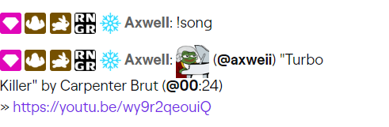
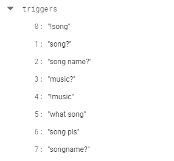

    

    
    
    

    <b>Want to know more details about this project and ACRCloud?</b> Check out this post: https://medium.com/@juriadams/273b2ae7a8cb

## Description

**`twitch-music-id`** is a twitch chat bot which automatically identifies music running in [twitch.tv](https://twitch.tv/) live streams, VODs, and clips.

The bot originally started as a school project in RATIRLs twitch channel and was intended to run for about 2 weeks to collect various data points to analyze later on. However, the project gained lots of positive feedback, which is why I kept it running. Today, the bot is part of **more than 100 twitch channels** and received **almost 200,000 song requests** of which about **85% were successful**.

## Example Usage

The bot responds to a set of **"triggers"**, some of which are:

## Running the Bot

At the moment, there is a lot of refactoring/cleaning up of the code going on. I will release the full source code of the bot in this repository once refactoring is finished.

This is necessary due to the bot starting out with very basic features and then having added more and more tweaks on top of it for many different streamers who wanted custom adjustments.

## Configuration

At the current time, the bot is administrated through its connected [Firestore database](https://cloud.google.com/firestore). Once configuration is changed there, the bot automatically loads the changes. This enables changes to be made on-the-fly and channels to be added/removed/altered without having to restart the bot.

A web interface or even an desktop app to run and manage the bot is definitely planned for the future, once the project is made fully public.

## Authors and Helpers

-   **Juri Adams** - _Initial Work_ - [@4dams](https://github.com/4dams)
-   **Twitch Chat** - _Testing the Bot_

## Contributing Streamers

Also, thanks a lot to the following streamers participating in this project, they have been really helpful and allowed me to test new features and run experiments in their chats.

[RATIRL](https://twitch.tv/ratirl), [ParnstarZilean](https://twitch.tv/parnstarzilean), [Kurttens](https://twitch.tv/Kurttens), [RANGERZX](https://twitch.tv/RANGERZX), [xArmin](https://twitch.tv/xArmin), [linnuwu](https://twitch.tv/linnuwu), [Katawina\_](https://twitch.tv/katawina_), and many more...

## License

This project is underlying the MIT-License. For more information, take a look at this projects LICENSE.md file.
